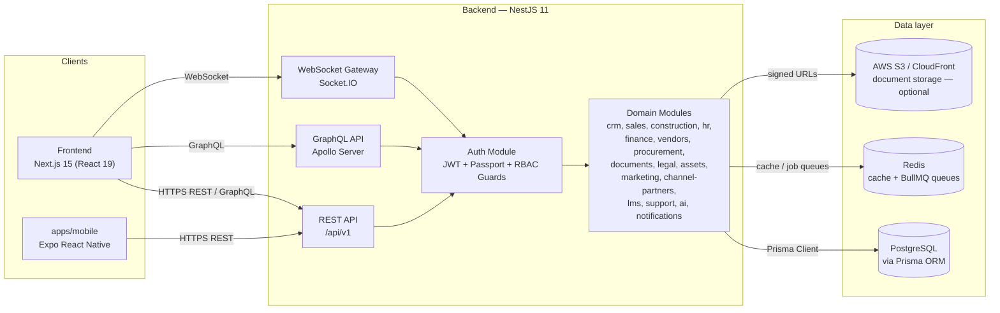

# Architecture

## Purpose

PropOS is an enterprise, multi-tenant SaaS ERP platform built for Indian real
estate developers. It consolidates the day-to-day operations of a developer
organization — CRM and sales pipeline, unit inventory and bookings,
construction progress tracking, HR/HRMS, finance and vendor management,
document/legal/asset management, marketing and channel-partner tracking, and
a lead-management (LMS) suite — into a single web and mobile product.

## High-level architecture

The platform is a TypeScript monorepo split into a Next.js web client, a
NestJS API, a shared Expo mobile app, and a set of shared internal packages,
orchestrated with Turborepo and pnpm workspaces.



### Backend (`backend/`)

- **Framework:** NestJS 11 (Express platform), exposing REST endpoints under
  `/api/v1`, a GraphQL endpoint (Apollo Server via `@nestjs/graphql`), and a
  Socket.IO WebSocket gateway for real-time features (e.g. the LMS data
  feed).
- **Domain modules** live under `backend/src/modules/` — one folder per
  bounded context: `auth`, `admin`, `crm`, `sales`, `construction`, `hr`,
  `finance`, `vendors`, `procurement`, `documents`, `legal`, `assets`,
  `marketing`, `channel-partners`, `lms`, `support`, `ai`, `customers`,
  `notifications`, `events`.
- **Cross-cutting code** lives under `backend/src/common/` (guards,
  interceptors, decorators, filters) and `backend/src/database/` (Prisma
  service wiring).
- **Background work:** BullMQ (Redis-backed) for queued/async jobs.
- **AI features:** an `ai` module with lead-scoring and follow-up-suggestion
  logic, designed to call OpenAI (`openai` SDK) — see Implementation Status
  in the root README for current stub/production status per feature.

### Frontend (`frontend/`)

- **Framework:** Next.js 15 (App Router) with React 19.
- **State/data:** TanStack Query for server state, Zustand for client state,
  React Hook Form + Zod for forms/validation.
- **UI:** Radix UI primitives, Tailwind CSS 4, `class-variance-authority`,
  Framer Motion, Recharts for dashboards/analytics.
- **Real-time:** `socket.io-client` for live updates (e.g. LMS data feed,
  notifications).
- Runs on port `3000` in development (`next dev`); the backend runs on
  `3001`.

### Mobile (`apps/mobile/`)

- Expo (React Native) app using `expo-router` for file-based navigation.
- Consumes the same backend REST API and the `@propos/shared-types` package
  for type-safe contracts with the server.

### `apps/api/`

- Reserved workspace slot in `pnpm-workspace.yaml` (`apps/*`) for a future
  standalone API app; currently empty. The production API today is
  `backend/`.

### Shared packages (`packages/`)

- **`@propos/shared-types`** — TypeScript types/interfaces shared between
  backend, frontend, and mobile (API DTOs, enums, domain models).
- **`@propos/shared-utils`** — framework-agnostic utility functions shared
  across apps.
- **`@propos/config`** — shared build/tooling configuration: base TypeScript
  configs for Node/NestJS and Next.js projects, and a base ESLint config.

### Data layer

- **PostgreSQL** is the system of record, accessed exclusively through
  **Prisma ORM** (`backend/prisma/schema.prisma`, 50+ models covering CRM,
  sales, construction, HR, finance, documents, legal, assets, marketing, and
  LMS domains). Migrations are managed with `prisma migrate`; `prisma/seed.ts`
  seeds demo data.
- **Redis** backs caching and BullMQ job queues.
- **AWS S3 / CloudFront** (optional) is used for document storage, accessed
  via HMAC-signed URLs (`STORAGE_URL_SECRET`).

### Authentication & authorization

- JWT-based auth (`@nestjs/jwt` + `passport-jwt`) with separate access and
  refresh token secrets/expiries (`JWT_SECRET`, `JWT_REFRESH_SECRET`).
- Role-based access control (RBAC) enforced via NestJS guards in
  `backend/src/common/`, applied per-route/resolver across domain modules.
- Multi-tenant: the platform is designed for multiple real-estate developer
  organizations ("companies"/tenants) with project- and company-scoped data
  access.
- Rate limiting via `@nestjs/throttler`; security headers via `helmet`.

## Repository layout

```
Realstate/
├── apps/
│   ├── api/            # reserved workspace slot (currently empty)
│   └── mobile/          # Expo React Native app (@propos/mobile)
├── backend/             # NestJS 11 API (@propos/backend)
│   ├── prisma/          # schema.prisma, migrations, seed.ts
│   └── src/
│       ├── common/      # guards, interceptors, decorators, filters
│       ├── database/    # Prisma service wiring
│       ├── graphql/     # GraphQL schema/resolvers setup
│       └── modules/     # domain modules (crm, sales, hr, finance, ...)
├── frontend/             # Next.js 15 web app (@propos/frontend)
├── infrastructure/
│   └── docker/           # docker-compose files (local infra, full stack)
├── packages/
│   ├── config/            # shared tsconfig/eslint config (@propos/config)
│   ├── shared-types/      # shared TS types (@propos/shared-types)
│   └── shared-utils/      # shared utilities (@propos/shared-utils)
├── package.json            # root workspace scripts (Turborepo pipelines)
├── pnpm-workspace.yaml      # workspace package globs
└── turbo.json                # Turborepo task graph (build/dev/lint/test)
```

## Tooling

- **Package manager:** pnpm (`packageManager: pnpm@9.15.0` in root
  `package.json`), with workspaces defined in `pnpm-workspace.yaml`.
- **Task orchestration:** Turborepo (`turbo.json`) drives `build`, `dev`,
  `lint`, `test`, and `db:generate` across the workspace with dependency-aware
  caching.
- **Language:** TypeScript throughout (backend, frontend, mobile, shared
  packages).
